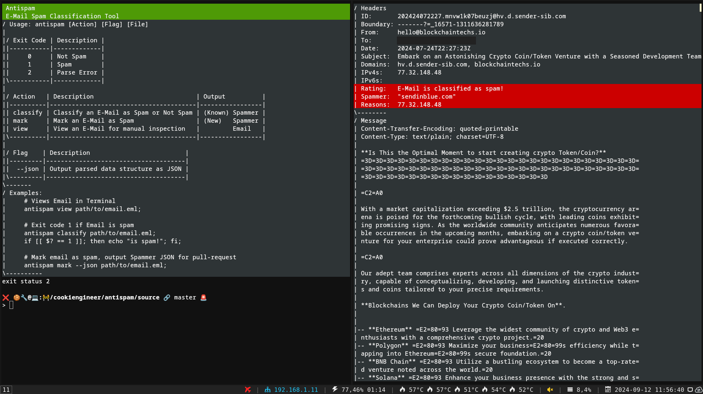

# antispam

This project is my attempt to fix the spam problem.

Currently this repository reflects the spam that I or my customers receive on a daily
basis, whereas it also includes providers that refuse to abide with the `abuse` report
policies because they have a conflict of interest to their paying customers (obviously).

## Usage



The usage of this tool is intended to be used via `cronjob`s or via `exec` on event.

```bash
# View an email and check for spam indicators
antispam view path/to/mail.eml;

# If an email is spam, return exit code 1
antispam classify path/to/mail.eml;

# Mark an email as spam
antispam mark-spam path/to/mail.eml;
```


## Postfix Configuration

The Postfix configuration is documented in [POSTFIX.md](./guides/POSTFIX.md) and uses
external `postmap` blocklists to block network prefixes and domains.

```bash
cd /path/to/antispam/toolchain;

# Upload and install postmap files
go run postfix.go install root@your.server.tld:2222;
```


# License

AGPL-3

